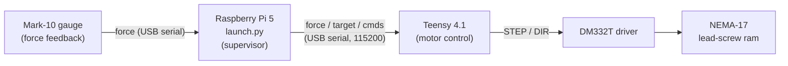

# NU CIGHT — TB Sonicator Testing Rig

A benchtop force-controlled sonication rig for developing a **point-of-care tuberculosis (TB)
sample-prep device**. TB cells have a tough, waxy wall that resists standard lysis, which blocks
the 15-minute [DASH rapid PCR system](https://www.nuclein.com/) from being used for TB in
low-resource clinics. Contact sonication breaks those cells open (and heat-inactivates the
sample), but the right **force, amplitude, and time** for TB lysis aren't established in the
literature.

**This repository is the testing rig that finds them.** It is a custom, Instron-style universal
tester: a stepper-driven ram presses a sample tube onto a sonicator horn at a precise,
closed-loop **constant force** while amplitude and run time are controlled and temperature is
logged. The rig exists to run a Design-of-Experiments (DoE) sweep of Force × Amplitude × Time,
scoring lysis by qPCR, to lock down optimal sonication parameters for the eventual handheld
product.

> For the full clinical background and design rationale, see the
> [capstone final report](BME390%20Capstone%20Final%20Report%20W2026.pdf).

> **See it in action:** a [short demo video](https://youtu.be/PqH8Qrmt4ng) showing closed-loop force control and remote operation over SSH.

---

## Repository layout

| Path | What's here |
|---|---|
| [Code/](Code/) | Rig software (the supervisor + firmware) and engineering docs |
| [Code/Python/launch.py](Code/Python/launch.py) | Raspberry Pi **supervisor**: state machine, force-gauge polling, serial I/O, safety, CSV logging |
| [Code/Teensy/032026_motor_proportional_control.ino](Code/Teensy/032026_motor_proportional_control.ino) | Teensy **firmware**: proportional setpoint control of the stepper + manual jog |
| [Code/TECHNICAL_OVERVIEW.md](Code/TECHNICAL_OVERVIEW.md) | Deep dive: architecture, serial protocol, state machine, safety model — **read this first** |
| [Code/INSTRUCTIONS_FOR_USE.md](Code/INSTRUCTIONS_FOR_USE.md) | Operator guide for running a trial (no programming needed) |
| [CIRCUIT_WIRING_GUIDE.md](CIRCUIT_WIRING_GUIDE.md) | Every wiring connection: power, stepper driver, relay, digital pot, AC input |
| [CAD/](CAD/) | Fusion 360 (`.f3z`) and STEP models of the rig, plus [3D printing notes](CAD/3D_PRINTING_NOTES.md) |
| [Datasheets/](Datasheets/) | Datasheets for every component (linked in the table below) |

---

## System overview



> Plain text: **Mark-10 gauge → Raspberry Pi (`launch.py`) → Teensy → DM332T driver →
> lead-screw ram.**

The work is split across two controllers. The **Raspberry Pi is the supervisor** — it reads the
force gauge, runs the trial state machine (seek contact → ramp → hold → release), enforces
software safety limits, and logs everything to CSV. The **Teensy owns the real-time control
loop** — a proportional controller that drives the stepper toward the target force the Pi streams
to it. The Teensy also sets sonicator amplitude (digital potentiometer) and toggles the sonicator
(relay). Full details, including the serial protocol and the safety model, are in
[TECHNICAL_OVERVIEW.md](Code/TECHNICAL_OVERVIEW.md).

---

## Hardware

| Component | Role | Datasheet |
|---|---|---|
| Raspberry Pi 5 (16 GB) | Supervisor computer (runs `launch.py`) | [PDF](Datasheets/Raspberry%20Pi%205%2016GB%20RAM.pdf) |
| Teensy 4.1 (SparkFun DEV-16996) | Real-time controller | [PDF](Datasheets/Sparkfun%20Teensy%204.1%20DEV-16996.pdf) |
| Mark-10 M2-10 force gauge (50 N, ±0.25 N) | Force feedback over USB serial | [PDF](Datasheets/Mark%2010%20Digital%20Force%20Gauge%20M2-10.pdf) |
| Mark-10 G1029 flat-head attachment | Force-gauge tip | [PDF](Datasheets/Mark%2010%20Flat%20Head%20Attachment%20G1029.pdf) |
| NEMA-17 lead-screw actuator (LMD17S13GF15-120) | Applies axial force (≤250 N thrust) | [PDF](Datasheets/StepperOnline%20NEMA%2017%20Linear%20Actuator%20LMD17S13GF15-120.pdf) |
| DM332T digital stepper driver | Drives the actuator (STEP/DIR) | [PDF](Datasheets/StepperOnline%20Digital%20Stepper%20Driver%20DM332T.pdf) |
| Sonics & Materials KITVC544 | Ultrasonic processor (sonicator horn) | [PDF](Datasheets/Sonics%20and%20Materials%20Ultrasonic%20Processor%20KITVC544.pdf) |
| Microchip MCP4131-103E digital pot | Sets sonicator amplitude | [PDF](Datasheets/Microchip%20Digital%20Potentiometer%20MCP4131-103E.pdf) |
| DFRobot 5A relay (DFR0017) | Toggles sonication start | [PDF](Datasheets/DFRobot%205A%20Relay%20Module%20DFR0017.pdf) |
| Amphenol ZTP-115M IR sensor | Non-contact tube temperature | [PDF](Datasheets/Amphenol%20Temperature%20Sensor%20ZTP-115M.pdf) |
| Mean Well LRS-350 (24 V, 350 W) | Main power supply | [PDF](Datasheets/Mean%20Well%20ACDC%20Converter%2024V%20350W%20LRS-350.pdf) |
| DFRobot LM2596 buck converter (DFR0379) ×2 | Steps 24 V down for the Pi and Teensy/relay | [PDF](Datasheets/DFRobot%20LM2596%20Breakout%20Board%20DFR0379.pdf) |
| McMaster-Carr IEC connector (542RN114) | AC mains inlet | [PDF](Datasheets/McMaster-Carr%20IEC%20Connector%20542RN114.pdf) |
| SPST rocker switch | Power switch | [PDF](Datasheets/Generic%20SPST%20Rocker%20Switch.pdf) |
| USA Scientific PP sample tube (1420-9710) | Sample vessel | [PDF](Datasheets/USA%20Scientific%20PP%20Sample%20Tube%201420-9710.pdf) |

Wire it up using [CIRCUIT_WIRING_GUIDE.md](CIRCUIT_WIRING_GUIDE.md); build the mechanical frame
from the [CAD models](CAD/) (40-series 80/20 extrusion + 3D-printed sonicator mount — see
[3D printing notes](CAD/3D_PRINTING_NOTES.md)).

---

## Quick start

### 1. Flash the Teensy firmware
1. Install the [Arduino IDE](https://www.arduino.cc/en/software) with the
   [Teensyduino](https://www.pjrc.com/teensy/td_download.html) add-on.
2. Open [032026_motor_proportional_control.ino](Code/Teensy/032026_motor_proportional_control.ino),
   select **Teensy 4.1** as the board, and upload.
3. Set the DM332T microstep/current DIP switches per
   [CIRCUIT_WIRING_GUIDE.md](CIRCUIT_WIRING_GUIDE.md#stepper-driver-switch-settings) (the firmware
   header also records the two profiles: `v1 -> 101111`, `v2 -> 101011`).

### 2. Set up the Raspberry Pi
```bash
pip install pyserial          # only dependency
```
Defaults: Teensy on `/dev/ttyACM0`, Mark-10 on `/dev/ttyUSB0`, both at 115200 baud (override with
`--teensy-port` / `--mark10-port`). **The Mark-10 must be configured to output Newtons** — no unit
conversion is performed.

### 3. Run a trial
```bash
# Hold 30 N for 60 seconds:
python3 launch.py --runtime 60 --target-force 30
```
`--runtime` (hold seconds) and `--target-force` (Newtons) are the only required arguments; run
`python3 launch.py --help` for the rest. Live single-key controls while running:

| Key | Action |
|---|---|
| `s` | Stop / pause the motor |
| `g` | Resume a paused run |
| `u` / `d` | Jog up / down (auto-stops) |
| `h` | Show help |
| `Ctrl+C` | Quit safely (stops motor, flushes log) |

Step-by-step operator instructions are in
[INSTRUCTIONS_FOR_USE.md](Code/INSTRUCTIONS_FOR_USE.md).

> **Safety:** The supervisor rejects any target above the **50 N** cap and faults (stopping the
> motor) on over-force, force-gauge dropout, or overshoot. The Teensy independently halts the
> motor within 100 ms if the Pi stops streaming force. There are **no homing or limit switches**
> on the ram — all travel bounds are software-side. See the safety model in
> [TECHNICAL_OVERVIEW.md](Code/TECHNICAL_OVERVIEW.md#7-safety-model).

### Logs
Every run auto-writes a timestamped CSV to a `logs/` folder beside `launch.py`
(`logs/sonicator_<YYYYMMDD-HHMMSS>.csv`) — one row per loop tick with timestamp, force, target,
state, and pause status.

---

## Status & next steps

**Built and validated.** The frame and sonicator mount are built to spec; the Pi, Teensy,
stepper driver, and motor communicate reliably on the shared supply, and the relay and digital
potentiometer have been integrated and exercised. Force is held in closed loop within ~1 N of
target — see the [demo video](https://youtu.be/PqH8Qrmt4ng) for closed-loop force control and
remote operation over SSH.

**Remaining work:**
- **Finish electrical integration** — move off the breadboard to thicker-gauge wiring with
  JST/spade connectors on a solderable board for reliable high-current delivery.
- **Run the DoE parameter sweep** — a 3-factor, 2-level design over
  Amplitude (12.6 / 14.7 / 16.8 µm), Force (20 / 30 / 40 N), and Time (2:15 / 3:00 / 3:45),
  scoring lysis by qPCR on *M. tuberculosis* H37Ra (attenuated).
- **Known gaps** (details in [TECHNICAL_OVERVIEW.md §10](Code/TECHNICAL_OVERVIEW.md#10-known-gaps--handoff-notes)):
  no homing/limit switches; gauge units are hard-coded to Newtons; two firmware variants exist in
  the field, so the supervisor's overshoot guard must stay in place.
